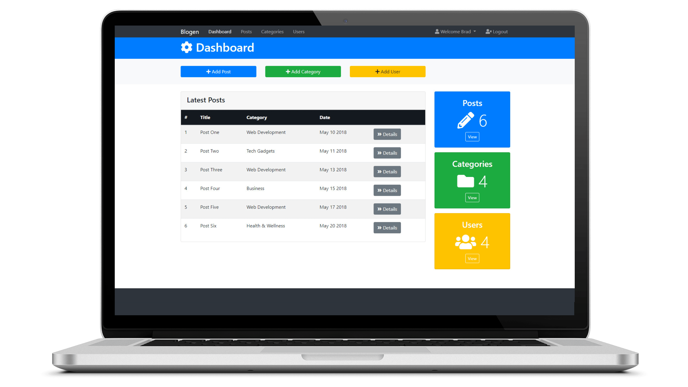
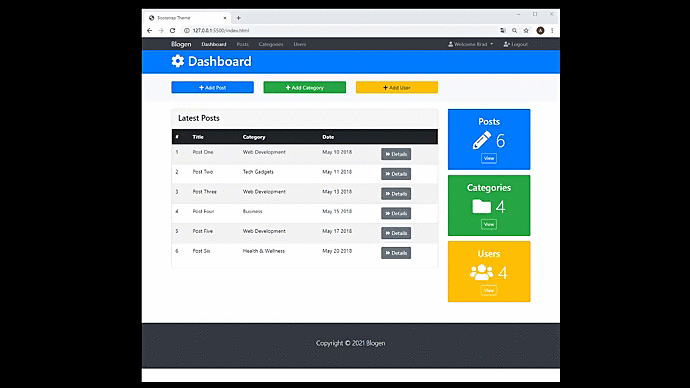

# Blogen - Post's Registration Panel
<!-- ------- Ancoras --------------->
<p align="center">
  <a href="#-sobre">Sobre</a>&nbsp;&nbsp;&nbsp;|&nbsp;&nbsp;&nbsp;
  <a href="#-projeto">Projeto</a>&nbsp;&nbsp;&nbsp;|&nbsp;&nbsp;&nbsp;
  <a href="#-telas">Telas</a>&nbsp;&nbsp;&nbsp;|&nbsp;&nbsp;&nbsp;
  <a href="#-tecnologias">Tecnologias</a>&nbsp;&nbsp;&nbsp;|&nbsp;&nbsp;&nbsp;
  <a href="#-licença">Licença</a>
</p>  
  
<!---------- Badges ----------------->  
<p align="center">
  
 
  

  

  
  <!----(4953b8)--BluePurple -->
  <!----(49AA26)--Green -->
  <!----(008ed6)--Blue -->
  <!----(3292a6)--BlueMedium-->
  <!----(444)----BlackMedium-->
  <!----(0074d9)----BluePrimary-->
</p>
<br>

<!---------- showcase  ----------------->  
<p align="center">
  
</p>

<!----- Acess Deploy Demonstration-->
 <h5 align="center">
    🎬 Clique Aqui: &nbsp; <a href="https://blogen-nine.vercel.app/">  Visualizar Demonstração </a> 
 </h5>


<!----- Description ------------------>

## 🔖 Sobre

&nbsp;&nbsp;&nbsp;&nbsp; Este projeto é um modelo de aplicação de um **blog**, basicamente o objetivo foi reproduzir um **painel** incluindo cadastros de categorias e usuarios em tela **Show-Modal**, Ha um cadastros de post's, como exemplo semelhante a ideia do editor de textos: **World Press**, tendo como apresentação dos registros em um **Dashboard**, com lista dos títulos  e detalhes  em grid e uma contagem de view em **cards** com ícones  para cada item de referencia ao link de sessão.  
<br>

## 💻 Projeto
  
&nbsp;&nbsp;&nbsp;&nbsp; A construção e desenvolvimento é front-end, seguindo os conceitos de aplicação das principais bibliotecas **Bootstrap 4**. &nbsp;&nbsp; O layou é responsivo com menus de navegações fixadas **Dropdown** na parte superior incluindo botões com eventos de apresentação de paginas de cadastro em **Modal**, incluído as configurações por **CSS** funções aplicadas a codificação em **Java Script**.

&nbsp;&nbsp; A uma sessão de **Card's**, inclui um **Dashboard** contendo ícones para somatórios de contagem de registros cadastrais e detalhes views(visualização) em lista tabela(grid) de conteúdos postados.

&nbsp;&nbsp;&nbsp;&nbsp; O Layout das demais paginas filhas para os endereços de links posicionados na **Dashboard**, basicamente são as seguintes paginas:
 > * **Posts** - Contem um cabeçalho com ícone uma lista(Grid) com paginações de cadastros dos últimos posts, incluindo botão pesquisa por categorias e um botão detalhes permitindo acesso a pagina de edição/exclusão dos mesmos, para editor de textos utilizei **CDN CKEditor 4** script: [CKedito](https://cdn.ckeditor.com/).
 >  *  **Categories** - Contem basicamente o mesmo conceito da pagina **Post**, porem a categorias, ícones e cor de cabeçalho e botão pesquisa correspondente ao item do tema em sessão.
 >  * **Users** - Segue o mesmo conceito de desenvolvimento das paina: "Categories"
 >  * **Profile** - Contem botões para alterar senha, excluir uma área de avatar para editar imagem, porem não esta ativo, por se tratar de projeto interface front-end.
 >  * **Settings** - Contem configurações simples incluindo uma caixa de seleção para alterar senha através de botões rádios, sobre formatação de paginas para usuários registrados.
 >  * **Logout** - Contem pagina login simples não tendo link, pois segue ideia interface do usuário que já esteja logado, sendo um exemplo que retorna a pagina principal.

<br>

###### **Curso :**  Bootstrap 4 and learning HTML5 semantics & CSS3- [Udemy](https://Udemy.com.br)
###### **Instrutor :** Brad Traversy
<br>

 <!----- Showcase Screens Shot------------------>

## 💻 **Telas**

<div align="center">
  
  
  
  
</div>
<br>
<br>

<!----- Configurations ---------------------------->

## 📌 Instruções : 

&nbsp;&nbsp;&nbsp;&nbsp;Para iniciar o Servidor da aplicação utilizando o **VsCode** use o comando: **_Open Whit Live Server_** então acesse pelo navegador **_http://127.0.0.1:5500/index.html_** 

<br>

## 🚀 Tecnologias

- [HTML5](https://pt.wikipedia.org/wiki/HTML5) - Hyper Text Markup Language -linguagem de marcação de hipertexto.
- [CSS3](https://pt.wikipedia.org/wiki/CSS3) - Cascading Style Sheets - estilização de código html.
- [Java Script](https://www.javascript.com/) -  Linguagem de programação utilizada em páginas web. Com o JS.
- [Bootstrap 4](https://getbootstrap.com/docs/4.1/getting-started/download/) - Framework de componentes de interface(front-end) web e mobile-first.
- [VS Code](https://code.visualstudio.com/) - Editor de desenvolvimento de aplicações web.

<br>

## 📝 Licença
<a href="https://opensource.org/licenses/MIT">
    
</a>

 &nbsp;&nbsp;&nbsp;&nbsp;Esse projeto está sob a licença MIT. Veja o arquivo [LICENSE](https://opensource.org/licenses/MIT) para mais detalhes.

 <br>

## 📁 Como Baixar o Projeto

```bash
  # Clonar o repósitorio
  $ git clone https://github.com/alxlima/Blogen.git
  
  # Entrar no diretório
  $ cd c:/blogen

  # Instalar as dependências
  $ npm install
  
  # Iniciar o Projeto
  $ npm start
```
#
 Desenvolvido 🚀 por: ***_Alex Sandro da Silva lima_***
 

[](https://www.linkedin.com/in/alex-sandro-da-silva-lima-8b297839/) 
[](mailto:alex_lima2013@hotmail.com)

